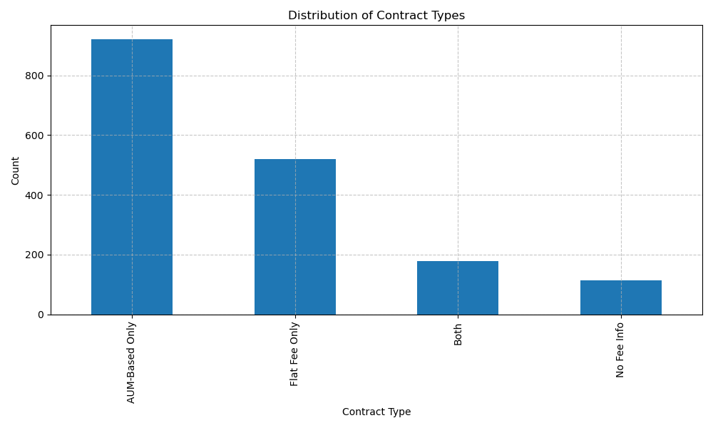
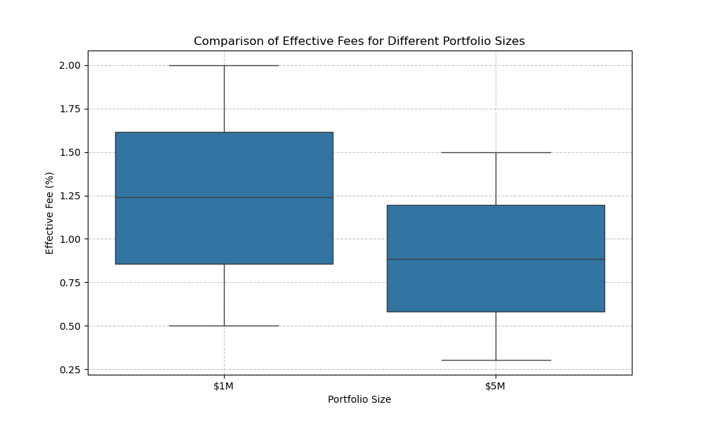
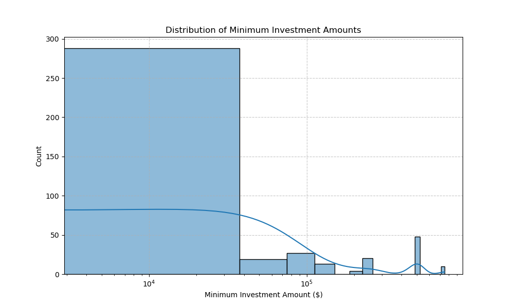
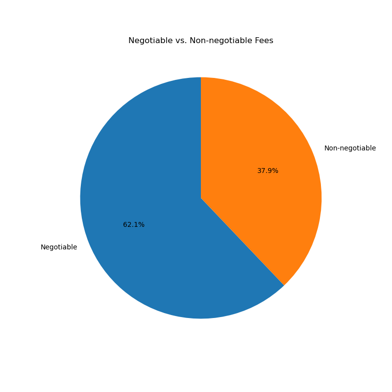
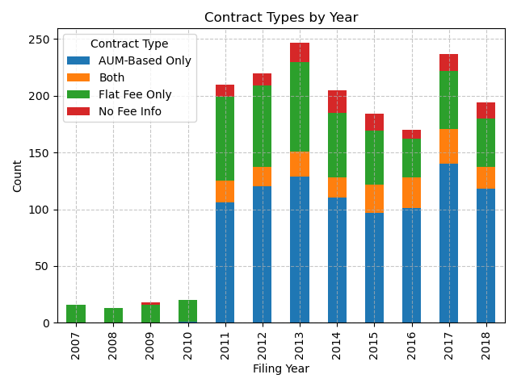
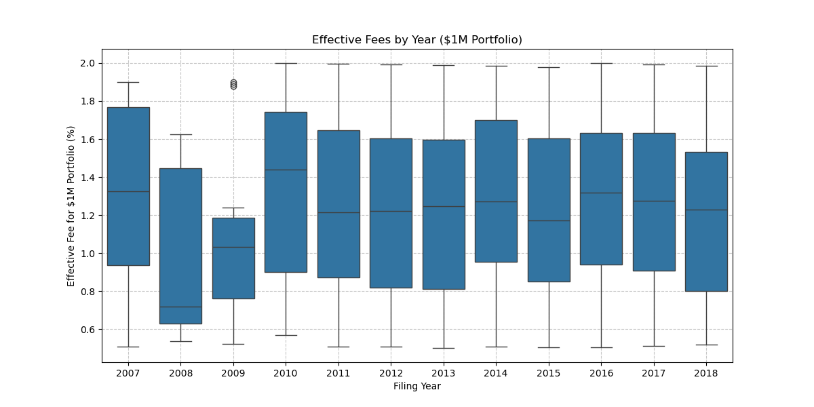
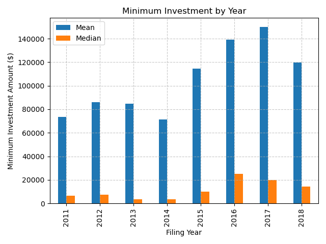
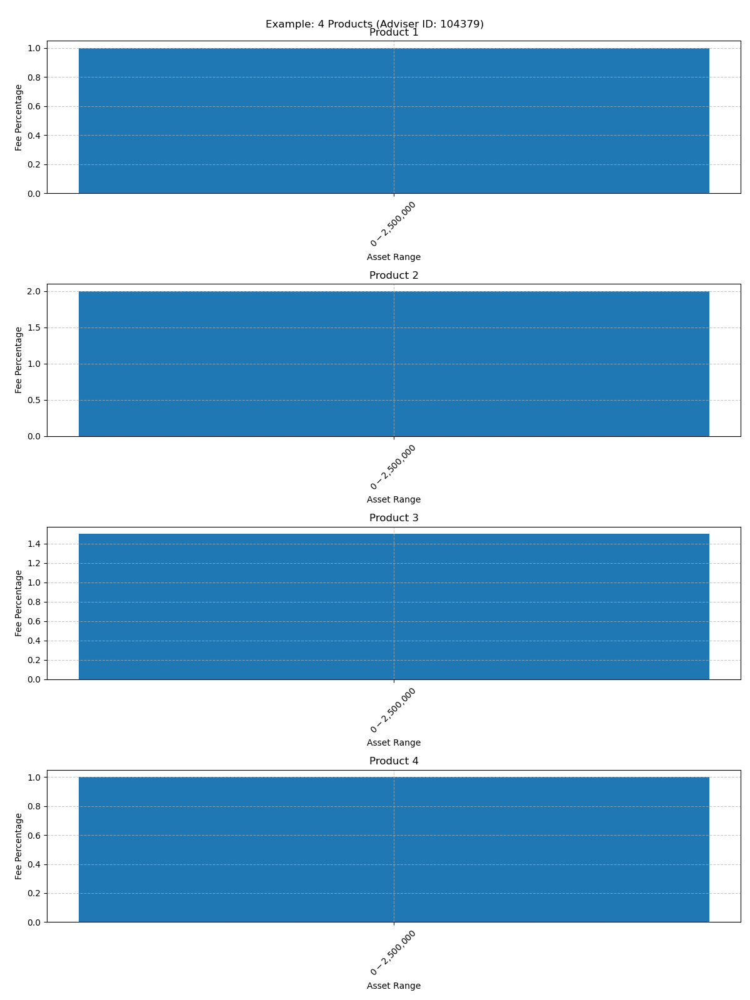
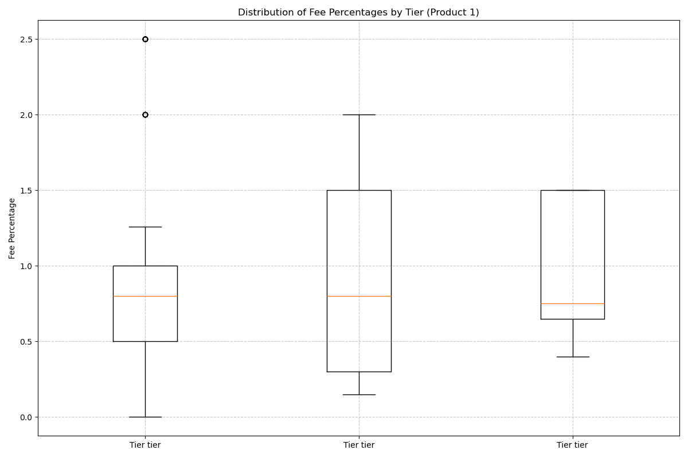

# Financial Adviser Fee Structure Analysis

## Project Overview

This project analyzes fee structures of financial advisers based on data extracted from regulatory filings (Form ADV Part 2). The dataset contains 1,734 records from different advisers, with information about their fee structures, minimum investment requirements, and negotiability of fees.

The data comes from 114 CSV files, each containing 18 columns and approximately 1,500 rows. The file naming convention includes adviser IDs and filing dates, which are extracted and used in the analysis.

## Codebase Structure

The project consists of several Python scripts, each focusing on different aspects of the data cleaning and analysis:

### Main Scripts

1. **`fee_data_cleaning.py`**
   - Performs basic data cleaning and initial analysis
   - Extracts adviser IDs and filing dates from filenames
   - Cleans fee thresholds, flat fees, minimum investment, and negotiable status
   - Identifies fee structure types (flat, tiered, etc.)
   - Generates summary statistics and basic visualizations

2. **`fee_structure_analysis.py`**
   - Focuses on analyzing fee structures in more detail
   - Detects and corrects misplaced answers in the data
   - Extracts structured fee data with product and tier information
   - Analyzes fee structures and generates visualizations

3. **`fee_visualization.py`**
   - Creates detailed visualizations of fee structures
   - Visualizes fee trends over time
   - Shows patterns in fee structures
   - Provides examples of different fee structure types
   - Compares fee structures across different advisers

4. **`multiple_products_analysis.py`**
   - Specifically analyzes advisers with multiple products
   - Calculates fee differences between products
   - Analyzes structure differences between products
   - Visualizes examples of multiple product offerings
   - Identifies patterns in how products are structured

5. **`analyze_fee_data.py`**
   - A simplified script that combines the most important analyses
   - More robust handling of data irregularities
   - Generates key visualizations and statistics
   - Detects multiple products using a different approach

6. **`run_fee_analysis.py`**
   - Orchestrates the execution of all analysis scripts
   - Runs scripts in sequence and handles errors
   - Generates a summary report of all analyses

7. **Enhanced Fee Analysis Scripts**
   - **`enhanced_fee_analysis_step1.py`**: Extracts adviser IDs and filing dates from filenames
   - **`enhanced_fee_analysis_step2.py`**: Processes flat fee information
   - **`enhanced_fee_analysis_step3.py`**: Processes fee thresholds and identifies products
   - **`enhanced_fee_analysis_step4.py`**: Processes minimum investment and negotiability information
   - **`enhanced_fee_analysis_step5.py`**: Generates summary statistics and visualizations

8. **`generate_example_visualizations.py`**
   - Creates visualizations of advisers with multiple products
   - Ensures examples have valid fee tier data
   - Generates clear examples of different product structures

### Output Files

1. **`cleaned_fee_data.csv`**
   - Contains the cleaned data with extracted adviser information
   - Includes cleaned fee thresholds, flat fees, minimum investment, etc.
   - Identifies fee structure types

2. **`structured_fee_data.csv`**
   - Contains structured fee data with product and tier information
   - Organizes fee thresholds and percentages by product and tier
   - Includes counts of products and tiers

3. **`fee_yearly_averages.csv`**
   - Contains average fee percentages by tier and year
   - Shows trends in fee percentages over time

4. **`fee_analysis_summary.md`**
   - Provides a summary of the analysis results
   - Includes key statistics and findings
   - Lists generated visualizations

5. **`fee_analysis_detailed_report.md`**
   - Provides a more detailed report of the analysis
   - Includes key findings, challenges, and recommendations
   - Discusses data irregularities and future work

6. **Enhanced Analysis Results**
   - **`enhanced_analysis_results/summary_statistics.txt`**: Comprehensive summary statistics
   - **`enhanced_analysis_results/consolidated_fee_data.csv`**: Cleaned and consolidated fee data
   - Various visualizations in the `enhanced_analysis_results` directory

### Visualizations

The scripts generate various visualizations to help understand the data. These visualizations are organized into several directories. Below are all the visualizations with descriptions:

## Enhanced Analysis Visualizations

### Contract Type Distribution

- Shows the distribution of different contract types (Flat Fee Only, AUM-Based Only, Both, No Fee Info)
- Reveals that 53.2% of advisers use AUM-based fees only, 30.0% use flat fees only, and 10.3% use both

### Effective Fee Comparison

- Compares effective fees for $1M and $5M portfolios
- Shows how fees decrease significantly as portfolio size increases
- Average effective fee for $1M portfolio: 1.24%
- Average effective fee for $5M portfolio: 0.89%

### Minimum Investment Distribution

- Shows the distribution of minimum investment requirements on a logarithmic scale
- Median minimum investment: $10,000
- 75th percentile: $100,000

### Negotiable Fee Distribution

- Shows the proportion of advisers offering negotiable vs. non-negotiable fees
- 62.1% of advisers offer negotiable fees

### Contract Types by Year

- Shows how the distribution of contract types has changed over time
- Tracks the evolution of fee structures in the industry from 2007 to 2018

### Effective Fees by Year

- Shows how effective fees for $1M portfolios have changed over time
- Helps identify trends in fee levels across the industry

### Minimum Investment by Year

- Shows how minimum investment requirements have changed over time
- Displays both mean and median values to account for outliers

## Root Directory Visualizations

### Fee Trends Over Time

- Shows how fee percentages have changed over time for the first product offered by financial advisers
- Tracks the average fee percentage for each tier across different years
- Helps identify if fees are trending upward or downward over time

### Fee Percentages by Tier

- Displays the distribution of fee percentages across different asset tiers
- Shows how advisers typically structure their fees based on client asset levels
- Demonstrates the common tiered pricing model where higher tiers have lower fee percentages

### Fee Distributions

- Shows the overall distribution of fee percentages across all advisers
- Helps identify the most common fee ranges in the market
- Highlights outliers that charge significantly higher or lower fees than the industry average

### Minimum Investment Distribution

- Displays the distribution of minimum investment requirements set by financial advisers
- Helps understand the entry barriers for clients seeking advisory services
- Identifies market segments targeted by different advisers

### Product Count Distribution

- Shows how many different fee products/services advisers typically offer
- Reveals whether most advisers specialize in a single product or diversify across multiple offerings

### Tier Count Distribution

- Displays the distribution of how many fee tiers advisers typically use in their pricing structures
- Helps understand the complexity of fee schedules in the industry

## Analysis Results Directory

### Fee Structure Types

- Categorizes and displays the distribution of different fee structure types used by advisers
- Helps understand the prevalence of different pricing models in the industry

### Negotiable Fees

- Shows the proportion of advisers who offer negotiable fees versus those with fixed fee structures
- Reveals flexibility in pricing across the industry

### Fee Percentages by Tier (Analysis Results)

- Alternative visualization of fee percentages across different asset tiers
- Formatted for inclusion in the final analysis report

### Fee Trends Over Time (Analysis Results)

- Alternative visualization of fee trends over time
- Formatted for inclusion in the final analysis report

### Minimum Investment

- Alternative visualization of minimum investment requirements
- Formatted for inclusion in the final analysis report

## Multiple Products Directory

### Product Count Distribution

- Specifically focuses on advisers offering multiple products
- Shows the distribution of how many different products they typically offer

### Fee Difference Distribution

- Shows the distribution of maximum fee differences between products offered by the same adviser
- Reveals how much price variation exists within an adviser's product lineup

### Product Count vs Fee Difference

- Examines the relationship between the number of products an adviser offers and the maximum fee difference
- Helps understand if advisers with more diverse product offerings tend to have greater fee variations

### Tier Difference Distribution

- Shows the distribution of differences in tier counts between products offered by the same adviser
- Reveals how advisers vary the complexity of their fee structures across different products

### Pattern Distribution

- Shows the distribution of common patterns in how advisers structure their multiple product offerings
- Identifies patterns such as having higher fees for specialized services or consistent fee structures

### Examples of Multiple Products

#### 2 Products Example


- Shows an example of an adviser offering 2 different products with their fee structures

#### 3 Products Example


- Shows an example of an adviser offering 3 different products with their fee structures

#### 4 Products Example


- Shows an example of an adviser offering 4 different products with their fee structures

## Visualizations Directory

### Product Count vs Max Tiers

- Examines the relationship between the number of products an adviser offers and the maximum number of fee tiers
- Helps understand if product diversification correlates with more complex fee structures

### Fee Percentages by Product

#### Product 0 Fee Percentages

- Shows the distribution of fee percentages by tier for the first product category

#### Product 1 Fee Percentages

- Shows the distribution of fee percentages by tier for the second product category

#### Product 2 Fee Percentages

- Shows the distribution of fee percentages by tier for the third product category

#### Product 3 Fee Percentages

- Shows the distribution of fee percentages by tier for the fourth product category

### Example Visualizations

#### Single Product with Multiple Tiers

- Provides a detailed example of an adviser offering a single product with multiple fee tiers
- Shows how fees decrease as asset levels increase

#### Multiple Products Example

- Shows an example of an adviser offering multiple products with different fee structures
- Illustrates real-world product differentiation strategies

### Comparison Visualizations

#### First Tier Distribution

- Shows the distribution of first-tier fees across all advisers
- Helps identify the most common entry-level fees in the market

#### First Tier By Year

- Tracks how first-tier fees have changed over time
- Reveals market pricing trends for entry-level advisory services

#### Adviser Fee Changes Over Time

##### Adviser 100 Fee Changes

- Tracks how Adviser 100 has changed their fee structure over time

##### Adviser 1037 Fee Changes

- Tracks how Adviser 1037 has changed their fee structure over time

##### Adviser 10046 Fee Changes

- Tracks how Adviser 10046 has changed their fee structure over time

##### Adviser 10091 Fee Changes

- Tracks how Adviser 10091 has changed their fee structure over time

##### Adviser 10105 Fee Changes

- Tracks how Adviser 10105 has changed their fee structure over time

## Key Findings

1. **Fee Structure Types**
   - Tiered fee structures: 59.7% of advisers
   - Flat fee structures: 11.0% of advisers
   - No fee information: 29.3% of advisers

2. **Contract Types (Enhanced Analysis)**
   - AUM-Based Only: 53.2% of advisers
   - Flat Fee Only: 30.0% of advisers
   - Both AUM-Based and Flat Fee: 10.3% of advisers
   - No Fee Information: 6.5% of advisers

3. **Fee Percentages**
   - Average fee for the first tier: 1.22%
   - Average fee for the second tier: 1.02%
   - Average fee for the third tier: 0.86%
   - Clear pattern of decreasing fees as AUM increases

4. **Effective Fees (Enhanced Analysis)**
   - Average effective fee for $1M portfolio: 1.24%
   - Average effective fee for $5M portfolio: 0.89%
   - Median effective fee for $1M portfolio: 1.24%
   - Median effective fee for $5M portfolio: 0.89%

5. **Negotiable Fees**
   - Original analysis: 89.4% of advisers offer negotiable fees
   - Enhanced analysis: 62.1% of advisers offer negotiable fees
   - Difference due to improved data cleaning and extraction methods

6. **Minimum Investment**
   - Original analysis: Median minimum investment: $100,000
   - Enhanced analysis: Median minimum investment: $10,000
   - 75th percentile: $100,000
   - Large variation in minimum requirements

7. **Multiple Products**
   - 54.2% of advisers potentially offer multiple products
   - Average fee difference between products: 0.42 percentage points
   - Average tier difference between products: 0.86 tiers

## Data Challenges and Solutions

1. **Inconsistent Formatting**
   - Challenge: Fee thresholds and percentages were not consistently formatted
   - Solution: Used regular expressions to extract values with different formats

2. **Misplaced Information**
   - Challenge: ChatGPT sometimes placed fee information in incorrect columns
   - Solution: Implemented detection and correction of misplaced answers

3. **Multiple Products**
   - Challenge: Many advisers have multiple products with different fee structures
   - Solution: Developed algorithms to identify and analyze multiple products

4. **Missing Data**
   - Challenge: About 29% of records had no fee information available
   - Solution: Handled missing data appropriately in the analysis

## How to Use the Code

1. **Basic Analysis**
   ```
   python analyze_fee_data.py
   ```
   This will perform a simplified analysis and generate key visualizations.

2. **Complete Analysis Pipeline**
   ```
   python run_fee_analysis.py
   ```
   This will run all analysis scripts in sequence and generate a comprehensive report.

3. **Enhanced Fee Analysis**
   ```
   # Run each step individually for detailed analysis
   python enhanced_fee_analysis_step1.py
   python enhanced_fee_analysis_step2.py
   python enhanced_fee_analysis_step3.py
   python enhanced_fee_analysis_step4.py
   python enhanced_fee_analysis_step5.py
   ```
   This step-by-step approach provides detailed insights into each aspect of the fee data.
   Each script builds on the results of the previous step, with the final step generating
   comprehensive summary statistics and visualizations in the `enhanced_analysis_results` directory.

4. **Individual Analyses**
   - For data cleaning: `python fee_data_cleaning.py`
   - For fee structure analysis: `python fee_structure_analysis.py`
   - For visualizations: `python fee_visualization.py`
   - For multiple products analysis: `python multiple_products_analysis.py`

5. **Generate Multiple Products Examples**
   ```
   python generate_example_visualizations.py
   ```
   This script generates clear examples of advisers with multiple products, ensuring that the examples have valid fee tier data.

## Future Work

1. **Product Classification**
   - Develop a more sophisticated algorithm to identify and classify different products

2. **Competitive Analysis**
   - Compare fee structures across advisers to identify competitive positioning

3. **Temporal Analysis**
   - Analyze how fee structures have changed over time for the same adviser

4. **Correlation Analysis**
   - Investigate relationships between fee structures and other adviser characteristics

5. **Market Segmentation**
   - Identify different market segments based on fee structures and minimum investment requirements

## Dependencies

- pandas >= 1.3.0
- numpy >= 1.20.0
- matplotlib >= 3.4.0
- seaborn >= 0.11.0
- requests >= 2.25.0
- re (regular expressions, standard library)
- datetime (standard library)
- os (standard library)
- sys (standard library)
- time (standard library)
- json (standard library)
- getpass (standard library)
- csv (standard library)

## Conclusion

This project provides a comprehensive analysis of financial adviser fee structures, revealing patterns in how fees are structured and how they vary across advisers. The code is designed to be reusable for future data, making it easy to analyze additional datasets as they become available.

The analysis reveals that tiered fee structures are the most common approach, with fees generally decreasing as AUM increases. Most advisers offer negotiable fees, and many have multiple products with different fee structures. The median minimum investment requirement is $100,000, but there is significant variation across advisers.

The extensive visualizations created in this project provide deep insights into fee structures, helping to understand:
- How fees vary across different asset tiers
- How fee structures have evolved over time
- The complexity of fee schedules in the industry
- How advisers differentiate their products through pricing
- The relationship between product diversity and fee structure complexity

These insights can be used for benchmarking, competitive analysis, and market segmentation in the financial advisory industry.

## Repository Information

This repository is maintained by TanveerAhmedKhan. The analysis was performed on a dataset of 114 CSV files containing financial adviser fee structures, with each file containing approximately 1,500 rows across 18 columns.
